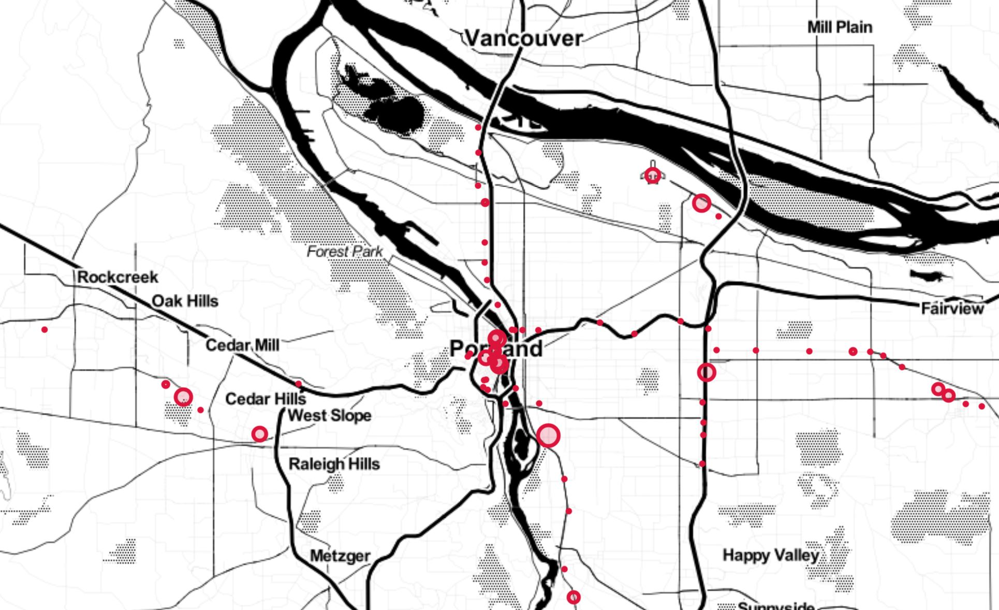

# Portland MAX Crime Map

2019 crimes occurences (YTD) aggregated by count only if they occured within 500 feet of a MAX (Portland light rail) station. An [interactive web app](https://portland-max-crime-counts.herokuapp.com) was created from the data, which allows users to obtain 2019 crime counts by individual MAX stop.

A report describing the full data collection, cleaning, and analytical methodology can be found [here](https://docs.google.com/document/d/1VD6SLtdKjNZb5CBEAppd0n3QqS9s6Nv3mnlgrhiskm8/edit?usp=sharing).
